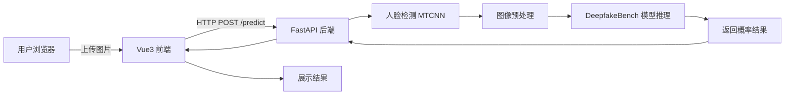

# 技术栈决策说明

## 调研结论（基于 DeepfakeBench 架构）

### 模型与推理
- DeepfakeBench 采用 PyTorch 框架，通过 YAML 配置驱动训练和测试
- 核心推理链路：`加载配置 → 构建模型 → 加载权重 → 预处理 → 前向推理 → 输出概率`
- 预处理通常包含：人脸检测(MTCNN/dlib) → 对齐 → resize → normalize
- 输出为二分类概率（0=真实，1=伪造）

### 环境要求
- Python >= 3.8
- PyTorch >= 1.12
- 依赖：opencv-python, torchvision, numpy, pillow, facenet-pytorch(人脸检测)
- GPU 推荐但 CPU 也可运行（慢）

## 推荐技术栈

| 层级 | 技术选型 | 理由 |
|------|---------|------|
| 前端 | Vue 3 + Element Plus | 组件丰富，上传组件成熟，国内生态好 |
| 后端 | Python FastAPI | 现代、自动 API 文档、异步文件处理 |
| 推理引擎 | DeepfakeBench PyTorch | 复用官方代码，确保结果一致 |
| 人脸预处理 | facenet-pytorch (MTCNN) | 纯 PyTorch，无需额外 dlib 编译 |
| 部署 | 本地运行 / Docker | 先本地验证，后续可容器化 |

## 架构图

